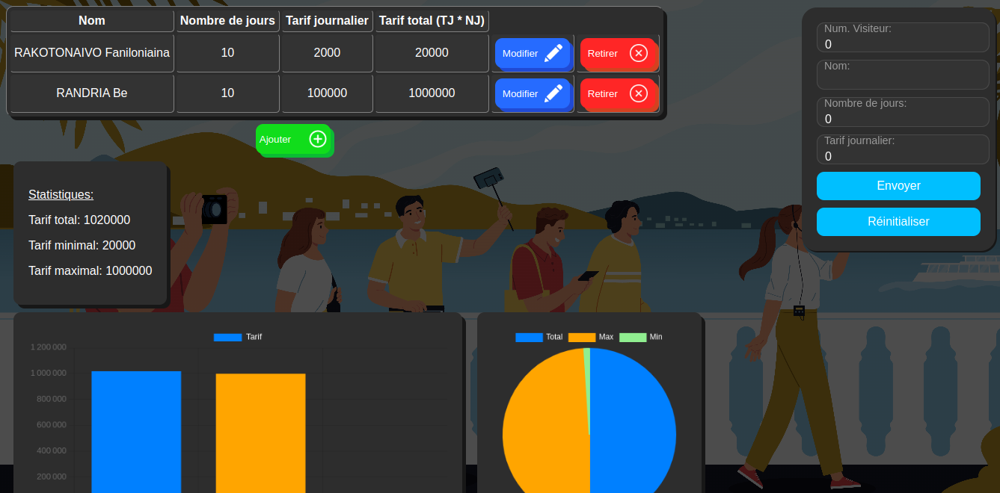

# Vue Application for managing Visitors
## Description
This is just a web applicaton, that is a scholar project, that manages visitors (maybe in a tourism org. ?), allows to perform CRUD operations on them and displays statistics (textually as well as with charts) about the said visitors' paid fees.

## Screenshot(s)


## Credits
* [Background image by macrovector on Freepik.](https://www.freepik.com/free-vector/guide-sightseeing-background-with-tourist-attraction-symbols-flat-vector-illsutration_41684701.htm#fromView=search&page=1&position=28&uuid=299cfb93-5e12-4388-ab90-c91e1cbce89d)
* [SVG Repo for the buttons icons etc...](svgrepo.com)

## Project setup
```
npm install
```

### Compiles and hot-reloads for development
```
npm run serve
```

### Compiles and minifies for production
```
npm run build
```

### Lints and fixes files
```
npm run lint
```

### Customize configuration
See [Configuration Reference](https://cli.vuejs.org/config/).
